

 

<h1 align="center">Datastory - Does size matter?</h1>

## Introduction
Customers are increasingly relying on **product rating** websites to inform their purchasing decisions. It has been demonstrated that when customers rate a product, they often exhibit a **tendency to be influenced by the previous ratings** of other customers, a phenomenon known as the **_herding effect_**.

Despite this, an unresolved research question revolves around comprehending **how ratings might be impacted by the scale of the vendor**. In order to try to answer rapidly to this question, the new Dean at EPFL decided to outsource the task to a brand-new data science spinoff of the University, the ToDoLeGAx Inc. Utilizing data sourced from beer reviews websites, ToDoLeGAx's objective is to investigate the **connection** between the **size of vendors** (specifically, breweries) and **the perceived quality** of their products.

Through the quantification of brewery size and popularity using **predefined metrics** and the **extraction of sentiment** from textual reviews, we want to understand if a correlation exists between vendor size and notoriety and perceived product quality. Additionally, we want to **explore the behaviors** of diverse consumer bases, considering **temporal dimensions** (how these phenomena have evolved over the years and seasons within the same year) and **spatial dimensions** (how these relationships differ across states and countries).

## Dive into our datasets

The first step to dive into our story is to understand our datasets. Our main source of data is the `BeerAdvocate` dataset, that contains beer reviews from all over the world over a period that ranges between 1996 and 2017, collected on the website [BeerAdvocate.com](https://www.beeradvocate.com/).
After the preprocessing, the dataset contains $42'923$ beers, $58'199$ users, $14'158$ breweries and a total of $2'587'598$ reviews.

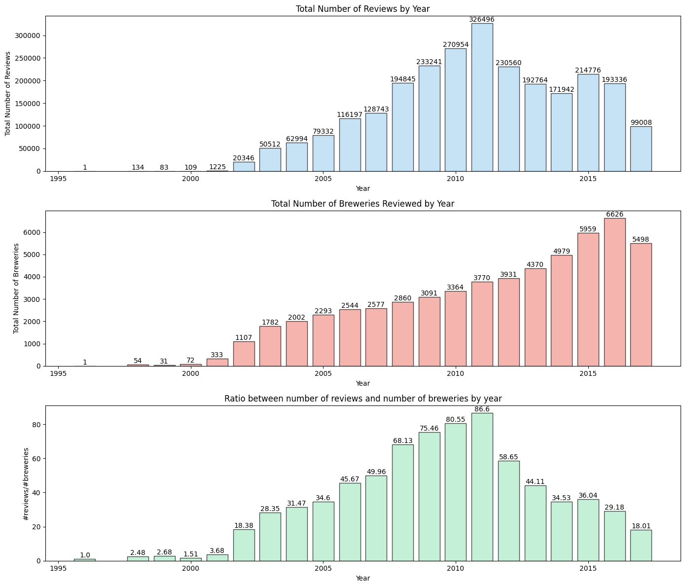

INSERT HERE GEOGRAPHICAL DONG's PLOTS

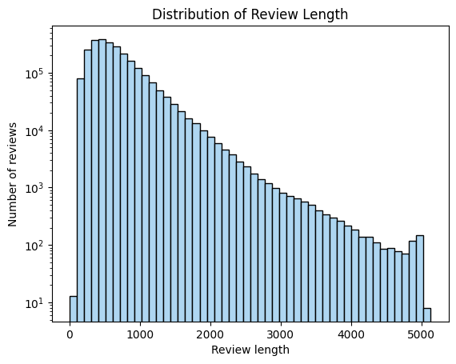

## Metrics Definition
To quantitatively **assess the characteristics of breweries**, we introduce a key metric, the **Size Metric**.

####  **Size Metrics**

$$ \text{Size} = \alpha N_r + \beta N_b + \gamma N_t$$

With:
- $N_r =$ number of reviews normalized by the total number of reviews
- $N_b =$ number of beers produced normalized by the total number of beers
- $N_t =$ number of different types (style) of beer produced normalized by the total number of styles

The metric is calculated for every year, and then normalized to get values between 0 and 1. A `Global Size Metric` is then obtained by averaging over the years.

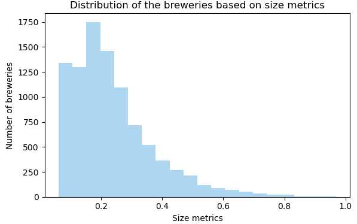

INSERT HERE DONG'S PLOTS ABOUT THE METRICS

The distribution of brewery sizes has remained fairly stable over the years. Nevertheless, since around 2014, the proportion of small breweries has tended to increase substantially. This growth can be partly explained by the strong interest in breweries and the creation of craft beers observed between 2015 and 2020. Google searches for the term brewery, for example, experienced strong increases during this period, which matches the results given by our size metric.

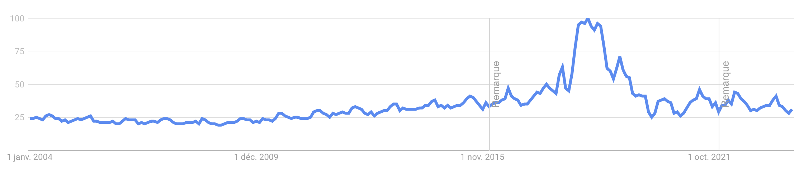

Once we have understood how our dataset is structured, and once we have defined and fine-tuned a meaningful Size metric, we can finally delve into our analysis.

## Is there a relationship between brewery size and the perceived quality of their beers?
Firstly, we would like to understand if there is any perceivable correlation between the size of the brewery and the rating obtained by its products.

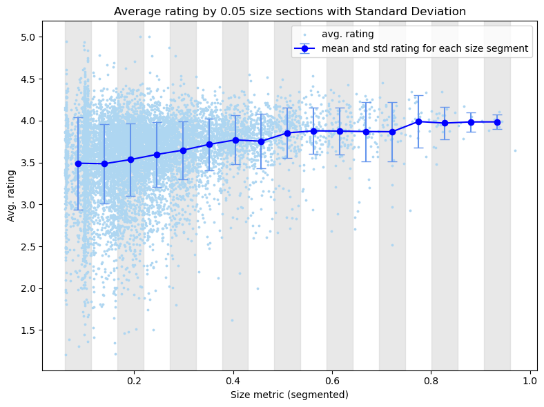

To give statistical relevance to our first impression, we can coarsely divide our breweries into 3 size categories ("small", "medium", "big"). By computing the mean and standard deviation of the ratings for each one of the 3 categories, we can then perform an hypothesis testing to see if there is some statistical differencens in terms of ratings.

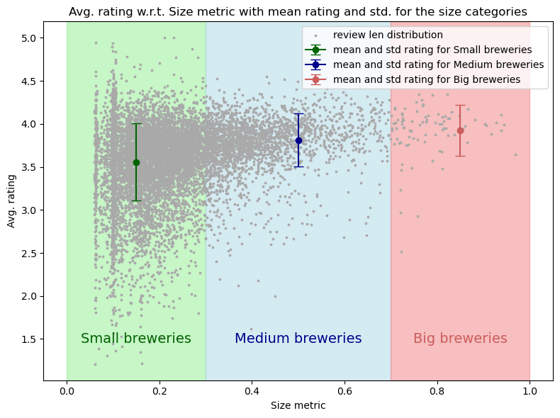

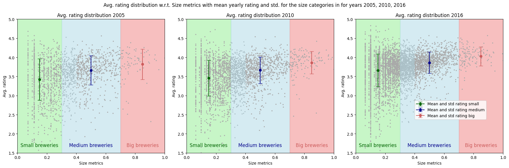

By setting a null hypothesis $H_0$ : *There is no statistically significant difference in average rating between the breweries size categories.*, we can perform a t-test analysis to see if the size category of a brewery impacts the average rate obtained:

T-statistic: -23.2306
P-value: 0.00000000
The difference in avg. rating is statistically significant between small and medium breweries.

T-statistic: -3.4624
P-value: 0.00077318
The difference in avg. rating is statistically significant between medium and big breweries.

We can conclude that there is likely to be a significant (at level $0.05$) statistical difference between the small, medium and large breweries in terms of the obtained average rating. Hence, it seems that being a larger brewery tends to increase the mean rating obtained and reduce the standard deviation.

## Do larger breweries get longer reviews?

Untill now we have only looked at the numerical rating. But a review is (usually) much more, and in every review there is a huge amount of information that can help us to measure the perceived quality of a product. For example, it would be interesting to assess if the brewery size impacts somehow on the average review length obtained by the breweries.

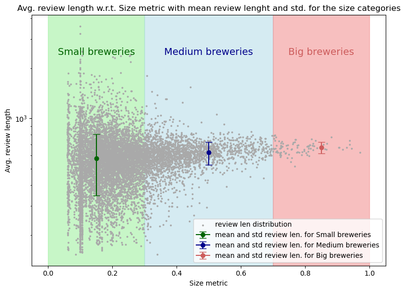

As before, to give statistical relevance to our first impression, we divide our breweries into 3 size categories ("small", "medium", "big"). By computing the mean and standard deviation of the ratings for each one of the 3 categories, we can then perform an hypothesis testing to see if there is some statistical differencens in terms of review length.

By setting a null hypothesis $H_0$ : *There is no statistically significant difference in average review length between the breweries size categories.*, we can perform a t-test analysis to see if the size category of a brewery impacts the average review length obtained:

T-statistic: -12.7465
P-value: 0.00000000
The difference in avg. review length is statistically significant between small and medium breweries.

T-statistic: -6.4931
P-value: 0.00000000
The difference in avg. review length is statistically significant between medium and big breweries.

Also in this case, we can conclude that there is likely to be a significant (at level $0.05$) statistical difference between the small, medium and large breweries in terms of the obtained average review length. Hence, it seems that being a larger brewery tends to increase the average length of the reviews, so that users seem to spend more effort in reviewing larger breweries.

## Does breweries size impact on their "basin of attraction?

Now we would like to gain insights into the geographical distribution of both breweries and reviewers. Ultimately, we aim to calculate the distances between breweries and their respective reviewers. This analysis could potentially unveil distinctions between brewery types, revealing whether certain types of breweries attract predominantly local reviewers or have a more globally dispersed audience.

We initiate our analysis by examining the geographical distribution of breweries in the dataset. To achieve this, we integrate the dataset with a map sourced from Geopandas (https://www.naturalearthdata.com/downloads/110m-cultural-vectors/).

Please notice that, for breweries located in the USA, the dataset includes information about the state. Consequently, we extend the same process to the states in the United States of America. 

The geodataframe for the USA can be accessed here: https://eric.clst.org/tech/usgeojson/

As evident from the data, **there are significantly more breweries in the US** compared to other countries. Due to this notable concentration, we'll consider **each US state as a distinct 'country'.** Additionally, we'll **visualize the global distribution of breweries** to gain a comprehensive understanding of their geographical spread.

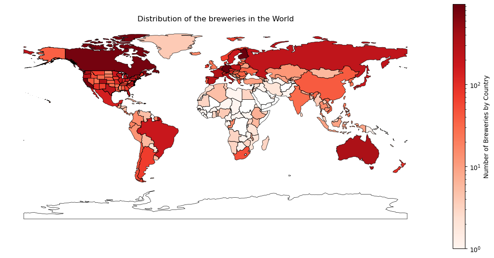

The revised analysis reveals distinct results. Germany takes the lead, followed by Finland, and several US states are now present in the Top 10. The conclusion of this analysis is that there are many more breweries in the US than anywhere else in the world. Acknowledging this, it becomes essential to consider the US's internal diversity in subsequent analyses. 

Now that we have gained insights into the distribution of breweries worldwide, we can apply a **similar analysis** to the **user data**. The aim of this analysis is to see whether or not a geographical similarity can be observed between the distribution of breweries and the distribution of users who give reviews. 

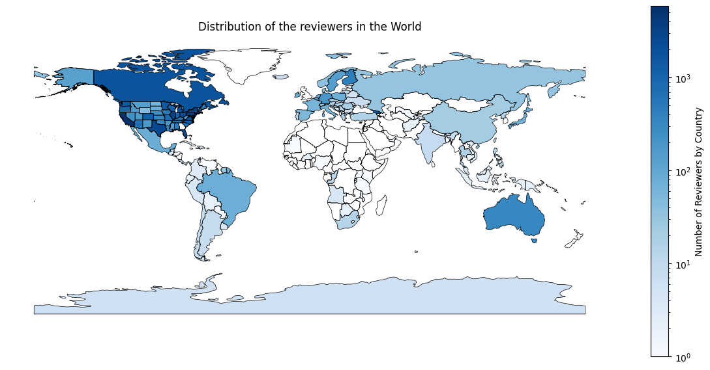

We can see that **the majority of reviewers are concentrated in the USA**. In fact, not only the majority of breweries but also the vast majority of reviewers are located in the USA. This is certainly a crucial factor to take into account in future analyses.

#### Relative distance between Reviewers and Breweries

Now that we have examined the geographical distribution of breweries and reviewers, our next focus is to **explore the relative distance between the reviewer and the brewery for each review**. This analysis aims to provide insights into **how the popularity of a brewery is distributed globally**.

We begin by calculating the centroid of each country (or each state, in the case of US). Subsequently, we add these centroid values to both the users and breweries dataframes

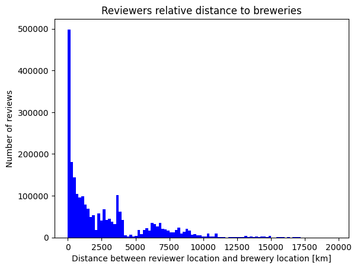

The graph showing the distribution of relative distances between reviewers and breweries for each review is quite diversified, with a large proportion of reviews between 0 and 10,000km, corresponding in notably to intra-USA reviews. Although this graph allows us to better visualize this distribution of relative distances, it should be noted that some distances exceeding 25'000km seem inconsistent and that it will be necessary in the future to correct this by potentially switching to GPS coordinates instead of the actual projection.

#### Is there a relationship between the size and the spatial distribution of the reviewers ?

It's now interesting to look at the relative distance of reviewers for a given brewery based on its **size** metric. This investigation would make it possible to discern whether a small local brewery receives a majority of reviews from nearby users, or whether a world-renowned brewery receives international reviews, resulting in a higher average distance.

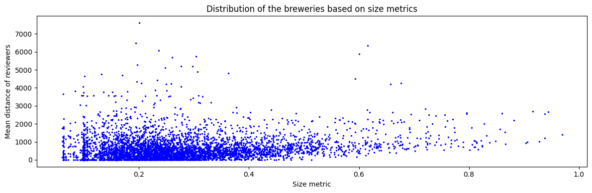

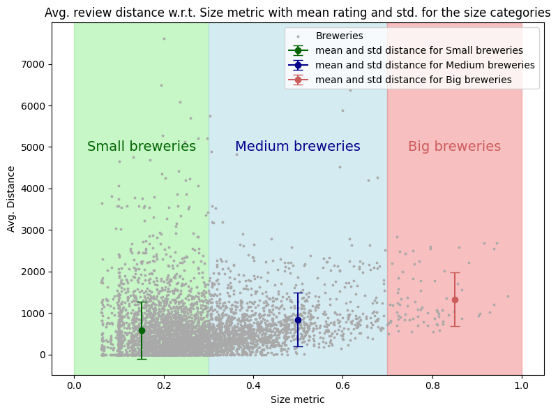

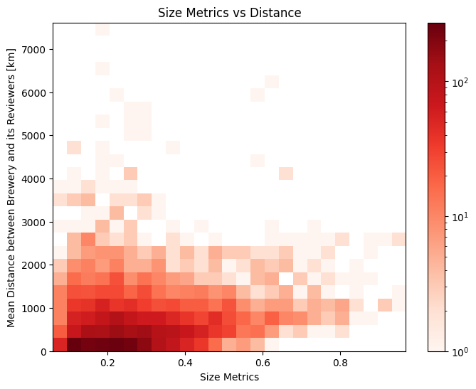

The graph above shows once again that the distribution of the average distance of reviews collected by breweries according to their size and popularity metrics is quite diverse. We see a majority of distances between 0 and 10'000km for a wide spectrum in terms of size metrics, and some seemingly inconsistent average distances (over 25'000km) which will have to be corrected later.

With regard to the popularity index, an interesting observation is the line that seems to form around the average review distance of 10'000km and concerns popular breweries. In fact, this distance corresponds to the distance USA - Europe and would indicate that the most popular breweries located mainly in Europe are highly rated by the overwhelming majority of US reviewers.

## Part III: Are there any evolutions or differences over the years ?

MAYBE TO TAKE OUT?
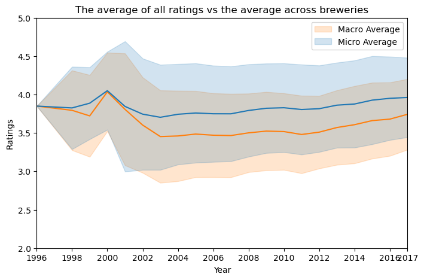

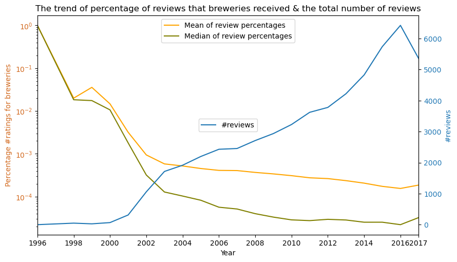

## ToDoLeGAx team line-up
In order to accomplish the goal, the Board of Directors at ToDoLeGAx SA. decided to create a new task force, specifically designed for this project. Here is the line-up of our team:

- Dong Chu: [@DongChu](https://github.com/chudonguestc), Head of the Web Development department
- Leonardo Trentini: [@LeonardoTrentini](https://github.com/leotrentini22), intern in the Web Development department
- Gabriele D'Angeli: [@GabrieleDAngeli](https://github.com/gabrieledangeli), senior engineer of the NLP department
- Tom Fahndrich: [@TomFahndrich](https://github.com/tomfahndrich), senior R&D engineer in the Data analysis department
- Axel Beguelin: [@AxelBeguelin](https://github.com/AxelBegue), junior R&D engineer in the Data analysis department
