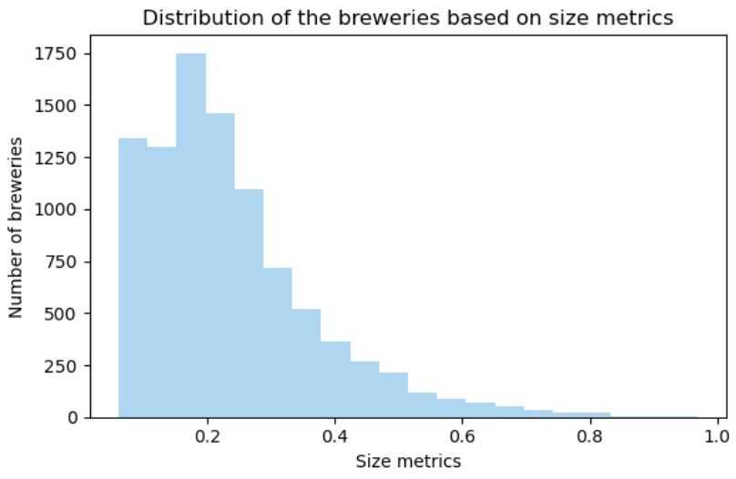

 

<h1 align="center">Datastory - Does size matter?</h1>

## Introduction
Customers are increasingly relying on **product rating** websites to inform their purchasing decisions. It has been demonstrated that when customers rate a product, they often exhibit a **tendency to be influenced by the previous ratings** of other customers, a phenomenon known as the **_herding effect_**.

Despite this, an unresolved research question revolves around comprehending **how ratings might be impacted by the scale and the reputation of the vendor**. In order to try to answer rapidly to this question, the new Dean at EPFL decided to outsource the task to a brand-new data science spinoff of the University, the ToDoLeGAx SA. Utilizing data sourced from beer reviews websites, ToDoLeGAx's objective is to investigate the **connection** between the **size and fame of vendors** (specifically, breweries) and **the perceived quality** of their products.

Through the quantification of brewery size and popularity using **predefined metrics** and the **extraction of sentiment** from textual reviews, we want to understand if a correlation exists between vendor size and notoriety and perceived product quality. Additionally, we want to **explore the behaviors** of diverse consumer bases, considering **temporal dimensions** (how these phenomena have evolved over the years and seasons within the same year) and **spatial dimensions** (how these relationships differ across states and countries).

## ToDoLeGAx team line-up
In order to accomplish the goal, the Board of Directors at ToDoLeGAx SA. decided to create a new task force, specifically disegned for this project. Here is the line-up of our team:

- Dong Chu: [@DongChu](https://github.com/chudonguestc), Head of the Web Development department
- Leonardo Trentini: [@LeonardoTrentini](https://github.com/leotrentini22), intern in the Web Development department
- Gabriele D'Angeli: [@GabrieleDAngeli](https://github.com/gabrieledangeli), senior engineer of the NLP department
- Tom Fahndrich: [@TomFahndrich](https://github.com/tomfahndrich), senior R&D engineer in the Data analysis department
- Axel Beguelin: [@AxelBeguelin](https://github.com/AxelBegue), junior R&D engineer in the Data analysis departmen

## Dive into our datasets

The first step to dive into our story is to understand our datasets. Our main source of data is the `BeerAdvocate` dataset, that contains beer reviews from all over the world over a period that ranges between 1996 and 2017, collected on the website [BeerAdvocate.com](https://www.beeradvocate.com/).
After the preprocessing, the dataset contains $42'923$ beers, $58'199$ users, $14'158$ breweries and a total of $2'587'598$ reviews.

INSERT SOME PLOTS ABOUT DATASET DISTRIBUTIONS

Two other datasets that will be helpful for our analysis, and in particular for the geographical investigation, are:
- `1:110m Cultural Vectors`: dataset with a map sourced from Geopandas (https://www.naturalearthdata.com/downloads/110m-cultural-vectors/).
- `GEOJSON AND KML DATA FOR THE UNITED STATES` : geographical data for the United States (https://eric.clst.org/tech/usgeojson/)

## Metrics Definition
To quantitatively **assess the characteristics of breweries**, we introduce a key metric, the **Size Metric**.

####  **Size Metrics**

$$ \text{Size} = \alpha N_r + \beta N_b + \gamma N_t$$

With:
- $N_r =$ number of reviews normalized by the total number of reviews
- $N_b =$ number of beers produced normalized by the total number of beers
- $N_t =$ number of different types (style) of beer produced normalized by the total number of styles

The metric is then normalized to get values between 0 and 1.

## What is the relationship between brewery size and the perceived quality of their beers?

## Part II: Do larger breweries tend to please a broader, potentially less sophisticated consumer base, while smaller breweries may craft more specialized, polarizing products, that resonate with a niche audience of enthusiasts ?

## Part III: Are there any evolutions or differences over the years ?

## Part IV: Do popular and/or big breweries tend to please a broader audience (spatial dimension) than less popular and/or smaller ones ?
