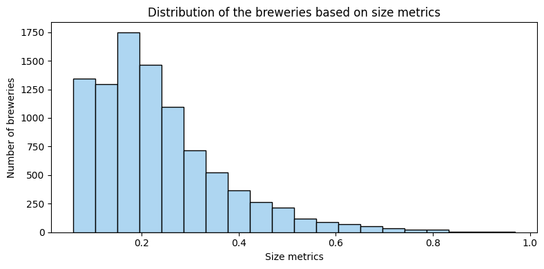
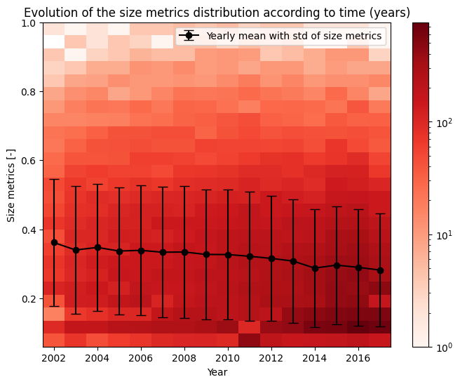

 

<h1 align="center">Datastory - Does size matter?</h1>

## Introduction
Customers are increasingly relying on **product rating** websites to inform their purchasing decisions. It has been demonstrated that when customers rate a product, they often exhibit a **tendency to be influenced by the previous ratings** of other customers, a phenomenon known as the **_herding effect_**.

Despite this, an unresolved research question revolves around comprehending **how ratings might be impacted by the scale and the reputation of the vendor**. In order to try to answer rapidly to this question, the new Dean at EPFL decided to outsource the task to a brand-new data science spinoff of the University, the ToDoLeGAx SA. Utilizing data sourced from beer reviews websites, ToDoLeGAx's objective is to investigate the **connection** between the **size and fame of vendors** (specifically, breweries) and **the perceived quality** of their products.

Through the quantification of brewery size and popularity using **predefined metrics** and the **extraction of sentiment** from textual reviews, we want to understand if a correlation exists between vendor size and notoriety and perceived product quality. Additionally, we want to **explore the behaviors** of diverse consumer bases, considering **temporal dimensions** (how these phenomena have evolved over the years and seasons within the same year) and **spatial dimensions** (how these relationships differ across states and countries).

## ToDoLeGAx team line-up
In order to accomplish the goal, the Board of Directors at ToDoLeGAx SA. decided to create a new task force, specifically disegned for this project. Here is the line-up of our team:

- Dong Chu: [@DongChu](https://github.com/chudonguestc), Head of the Web Development department
- Leonardo Trentini: [@LeonardoTrentini](https://github.com/leotrentini22), intern in the Web Development department
- Gabriele D'Angeli: [@GabrieleDAngeli](https://github.com/gabrieledangeli), senior engineer of the NLP department
- Tom Fahndrich: [@TomFahndrich](https://github.com/tomfahndrich), senior R&D engineer in the Data analysis department
- Axel Beguelin: [@AxelBeguelin](https://github.com/AxelBegue), junior R&D engineer in the Data analysis departmen

## Dive into our datasets

The first step to dive into our story is to understand our datasets. Our main source of data is the `BeerAdvocate` dataset, that contains beer reviews from all over the world over a period that ranges between 1996 and 2017, collected on the website [BeerAdvocate.com](https://www.beeradvocate.com/).
After the preprocessing, the dataset contains $42'923$ beers, $58'199$ users, $14'158$ breweries and a total of $2'587'598$ reviews.

INSERT SOME PLOTS ABOUT DATASET DISTRIBUTIONS

Two other datasets that will be helpful for our analysis, and in particular for the geographical investigation, are:
- `1:110m Cultural Vectors`: dataset with a map sourced from Geopandas (https://www.naturalearthdata.com/downloads/110m-cultural-vectors/).
- `GEOJSON AND KML DATA FOR THE UNITED STATES` : geographical data for the United States (https://eric.clst.org/tech/usgeojson/)

## Metrics Definition
To quantitatively **assess the characteristics of breweries**, we introduce a key metric, the **Size Metric**.

####  **Size Metrics**

$$ \text{Size} = \alpha N_r + \beta N_b + \gamma N_t$$

With:
- $N_r =$ number of reviews normalized by the total number of reviews
- $N_b =$ number of beers produced normalized by the total number of beers
- $N_t =$ number of different types (style) of beer produced normalized by the total number of styles

The metric is then normalized to get values between 0 and 1.

## What is the relationship between brewery size and the perceived quality of their beers?

We can also perform a regression analysis between the average rating and the size metric.

We now compute the mean and standard deviation of the ratings for each of the 3 brewery size categories (small, medium, big) to see if there is some statistical differencens in terms of ratings.

RESULTS:

Mean rating for the small breweries in 2005 :  3.417635339556324 with std:  0.5416897371206717
Mean rating for the medium breweries in 2005 :  3.6590237499902742 with std:  0.3819777162309161
Mean rating for the big breweries in 2005 :  3.8211583043211763 with std:  0.39780901975150573

Mean rating for the small breweries in 2010 :  3.4589803057935846 with std:  0.468034229353236
Mean rating for the medium breweries in 2010 :  3.662618282691247 with std:  0.345778978902311
Mean rating for the big breweries in 2010 :  3.860970275247962 with std:  0.29364326495105714

Mean rating for the small breweries in 2016 :  3.65933681183031 with std:  0.4267120211283632
Mean rating for the medium breweries in 2016 :  3.8621675113421876 with std:  0.27817589295617257
Mean rating for the big breweries in 2016 :  4.027905703698564 with std:  0.25037943662726764

We perform t-test anlysis at the 0.05 significance level under the hypotesis $H_0$ : *There is no statistically significant difference in average rating between the breweries size categories.* To see if the size category of a brewery impacts the average rate obtained:

T-statistic: -23.2306
P-value: 0.00000000
The difference in avg. rating is statistically significant between small and medium breweries.

T-statistic: -3.4624
P-value: 0.00077318
The difference in avg. rating is statistically significant between medium and big breweries.

We can conclude that there is likely to be a significant (at significance level 0.05) statisticall difference between the small, medium and large breweries in term of rating obtained. Given the plot just on top, being a bigger breweries tend to increase the mean rating obtained and reduce the standard deviation.

## Reviews' length VS breweries' size

We do the same analysis but to see if the brewery size metrics impacts the average review length obtained by the breweries

We perform t-test anlysis at the 0.05 significance level under the hypotesis $H_0$ : *There is no statistically significant difference in average review length between the breweries size categories.* To see if the size category of a brewery impacts the average review length obtained.

T-statistic: -12.7465
P-value: 0.00000000
The difference in avg. review length is statistically significant between small and medium breweries.

T-statistic: -6.4931
P-value: 0.00000000
The difference in avg. review length is statistically significant between medium and big breweries.

## Are there different behaviors in different places?

The goal of this section is to gain insights into the geographical distribution of both breweries and reviewers within the dataset. Ultimately, we aim to calculate the distances between breweries and their respective reviewers. This analysis could potentially unveil distinctions between brewery types, revealing whether certain types of breweries attract predominantly local reviewers or have a more globally dispersed audience.

We initiate our analysis by examining the geographical distribution of breweries in the dataset. To achieve this, we integrate the dataset with a map sourced from Geopandas (https://www.naturalearthdata.com/downloads/110m-cultural-vectors/).

Ensuring alignment between the country names used in the map and those in the brewery dataset is crucial. To address this, we calculate the Hamming distance between them and substitute the brewery location with the closest match. In instances where no match is found, we opt to eliminate the corresponding brewery. This scenario applies to 26 breweries out of over 14,000, which is deemed acceptable for this level of analysis. It's worth noting that some removed breweries had HTTP links as their location, explaining the lack of match with the map.

For breweries located in the USA, the dataset includes information about the state. Consequently, we extend the same process to the states in the United States of America. To facilitate this, we introduce a new column, 'state,' in the dataframe. This allows us to split the location of US breweries into 'country' and 'state.' 

The geodataframe for the USA can be accessed here: https://eric.clst.org/tech/usgeojson/

As evident from the data, **there are significantly more breweries in the US** compared to other countries. Due to this notable concentration, we will consider the breweries by states in the next section. To facilitate this, we extend the world geodataframe by incorporating the US state geodataframe in the next section.

Let's look again to the Top 10 countries with the highest number of breweries. However, this time, we'll consider **each US state as a distinct 'country'.** Additionally, we'll **visualize the global distribution of breweries** to gain a comprehensive understanding of their geographical spread.

The revised analysis reveals distinct results. Germany takes the lead, followed by Finland, and several US states are now present in the Top 10. The conclusion of this analysis is that there are many more breweries in the US than anywhere else in the world. Acknowledging this, it becomes essential to consider the US's internal diversity in subsequent analyses. Given the availability of information about individual US states, incorporating them into the analysis could provide valuable insights, offering a more nuanced understanding of the brewing landscape within the country.

Now that we have gained insights into the distribution of breweries worldwide, we can apply a **similar analysis** to the **user data**. The aim of this analysis is to see whether or not a geographical similarity can be observed between the distribution of breweries and the distribution of users who give reviews. Once again, a matching process based on Hamming's distance must be performed to match the names of the different places.

We can see that **the majority of reviewers are concentrated in the USA**. In fact, not only the majority of breweries but also the vast majority of reviewers are located in the USA. This is certainly a crucial factor to take into account in future analyses.

#### Relative distance between Reviewers and Breweries

Now that we have examined the geographical distribution of breweries and reviewers, our next focus is to **explore the relative distance between the reviewer and the brewery for each review**. This analysis aims to provide insights into **how the popularity of a brewery is distributed globally**.

To achieve this, we begin by calculating the centroid of each country (or state in the case of US). Subsequently, we add these centroid values to both the users and breweries dataframes

The graph showing the distribution of relative distances between reviewers and breweries for each review is quite diversified, with a large proportion of reviews between 0 and 10,000km, corresponding in notably to intra-USA reviews. Although this graph allows us to better visualize this distribution of relative distances, it should be noted that some distances exceeding 25'000km seem inconsistent and that it will be necessary in the future to correct this by potentially switching to GPS coordinates instead of the actual projection.

#### Is there a relationship between the size and the spatial distribution of the reviewers ?

It's now interesting to look at the relative distance of reviewers for a given brewery based on its **size** metric. This investigation would make it possible to discern whether a small local brewery receives a majority of reviews from nearby users, or whether a world-renowned brewery receives international reviews, resulting in a higher average distance.

The graph above shows once again that the distribution of the average distance of reviews collected by breweries according to their size and popularity metrics is quite diverse. We see a majority of distances between 0 and 10'000km for a wide spectrum in terms of size metrics, and some seemingly inconsistent average distances (over 25'000km) which will have to be corrected later.

With regard to the popularity index, an interesting observation is the line that seems to form around the average review distance of 10'000km and concerns popular breweries. In fact, this distance corresponds to the distance USA - Europe and would indicate that the most popular breweries located mainly in Europe are highly rated by the overwhelming majority of US reviewers.

## Part III: Are there any evolutions or differences over the years ?

MAYBE TO TAKE OUT?

## Part IV: Do popular and/or big breweries tend to please a broader audience (spatial dimension) than less popular and/or smaller ones ?
