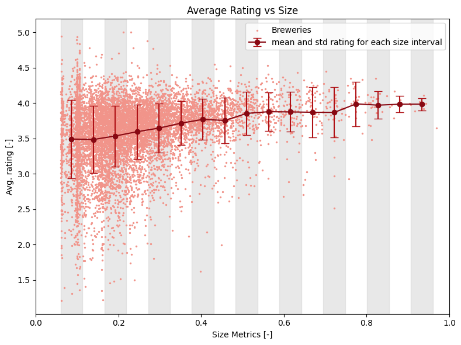
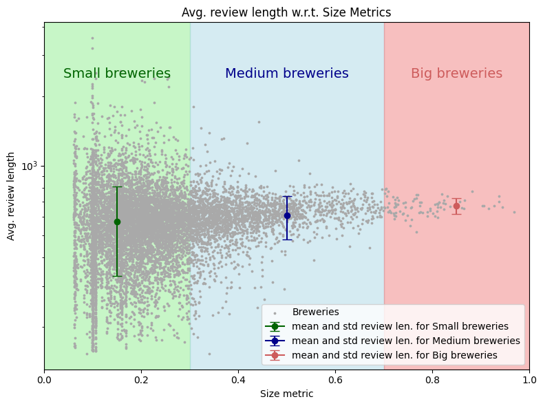
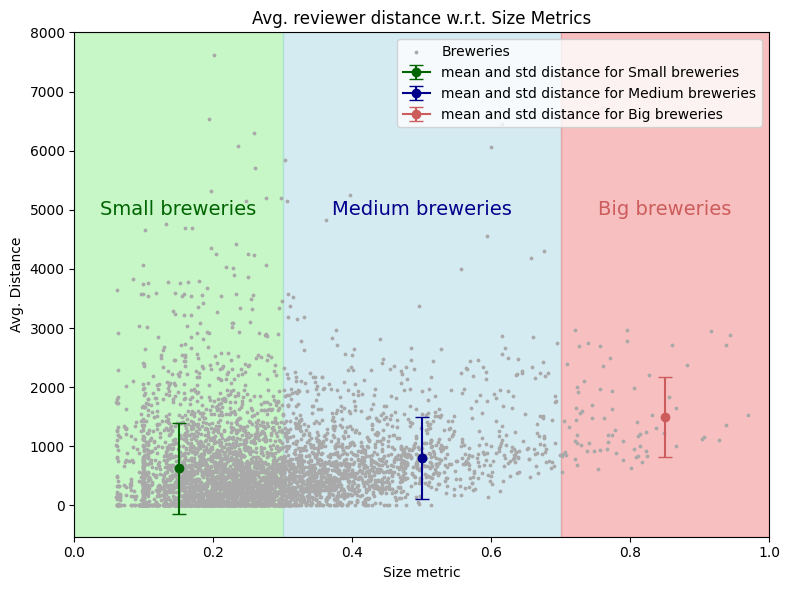

 

<h1 align="center">Datastory - Does size matter?</h1>

## Introduction
Customers are increasingly relying on **product rating** websites to inform their purchasing decisions. It has been demonstrated that when customers rate a product, they often exhibit a **tendency to be influenced by the previous ratings** of other customers, a phenomenon known as the **_herding effect_**.

Despite this, an unresolved research question revolves around comprehending **how ratings might be impacted by the scale of the vendor**. In order to try to answer rapidly to this question, the new Dean at EPFL decided to outsource the task to a brand-new data science spinoff of the University, the ToDoLeGAx Inc. Utilizing data sourced from beer reviews websites, ToDoLeGAx's objective is to investigate the **connection** between the **size of vendors** (specifically, breweries) and **the perceived quality** of their products.

Through the quantification of brewery size using a **predefined metric** and the **extraction of sentiment** from textual reviews, we want to understand if a correlation exists between vendor size and notoriety and perceived product quality. Additionally, we want to **explore the behaviors** of diverse consumer bases, considering **temporal dimensions** (how these phenomena have evolved over the years and seasons within the same year) and **spatial dimensions** (how these relationships differ across states and countries).

## Dive into our datasets

The first step before tackling our story is to understand our datasets. Our main source of data is the `BeerAdvocate` dataset, that contains beer reviews from all over the world over a period that ranges between 1996 and 2017, collected on the website [BeerAdvocate.com](https://www.beeradvocate.com/).
After the preprocessing, the dataset contains $42'923$ beers, $58'199$ users, $14'158$ breweries and a total of $2'587'598$ reviews, with both textual contents and numerical ratings.

It is interesting also to have a look at the geographical distribution of both breweries and reviewers. 

As evident from the data, **there are significantly more breweries in the US** compared to other countries. Due to this notable concentration, we'll consider **each US state as a distinct 'country'.** Additionally, we'll **visualize the global distribution of breweries** to gain a comprehensive understanding of their geographical spread.

We can apply a similar analysis to the **user data**, in order to see whether or not a geographical similarity can be observed between the distribution of breweries and the distribution of users who give reviews. 

We can see that not only the majority of breweries but also the vast majority of reviewers are located in the USA. This is certainly a crucial factor that we will have to take into account in our future analysis.

INSERT INTERACTIVE GEOGRAPHICAL DONG's PLOTS

We can also explore the **relative distance** between the reviewer and the brewery for each review. 

A large proportion of reviews is located between $0$ and $10'000$ km, corresponding in notably to intra-USA reviews. 

## Metrics Definition
Before proceeding with our analysis, to quantitatively **assess the characteristics of breweries** we introduce a key metric, the **Size Metric**.

####  **Size Metrics**

$$ \text{Size} = \alpha*log(N_r) + \beta*log(N_b) + \gamma*log(N_t)$$

With:
- $N_r =$ number of reviews normalized by the total number of reviews
- $N_b =$ number of beers produced normalized by the total number of beers
- $N_t =$ number of different types (style) of beer produced normalized by the total number of styles

The metric is calculated for every year, and then normalized to get values between 0 and 1. A `global size metric` is then obtained by averaging the size metric over the years.

INSERT HERE DONG'S PLOTS ABOUT THE METRICS

The distribution of breweries' sizes has remained fairly stable over the years. Nevertheless, since around 2014, the proportion of small breweries has tended to increase substantially. This growth can be partly explained by the strong interest in breweries and the creation of craft beers observed between 2015 and 2020. Google searches for the term "brewery", for example, experienced a strong increase during this period, a growth that somehow matches the results given by our size metric.

Once we understood how our dataset is structured, and once we defined and fine-tuned a meaningful size metric, we can finally dive into our story.

## Is there a relationship between brewery size and the perceived quality of their beers?
Firstly, we would like to understand if there is any perceivable correlation between the size of the brewery and the rating obtained by its products.

By performing a linear regression analysis, we can clearly see that there is a positive linear correlation between the size metric and the average rating, with an high $R^2$ score. However, we must remain cautious with these results, as it is likely that other cofounders, not taken into account through our size metric, have though an impact on the average rating obtained by the breweries (it is possible that our size index does not explain everything).

To give statistical relevance to our first impression, we can coarsely divide our breweries into 3 size categories ("small", "medium", "big"). By computing the mean and standard deviation of the ratings for each one of the 3 categories, we can then perform an hypothesis testing to see if there is some statistical differencens in terms of ratings.

By setting a null hypothesis $H_0$ : *There is no statistically significant difference in average rating between the breweries size categories.*, we can perform a t-test analysis to see if the size category of a brewery impacts the average rate obtained:

*T-statistic: $-23.2306$, P-value: $0.00000000$ $\rightarrow$ The difference in avg. rating is statistically significant between small and medium breweries.*

*T-statistic: $-3.4624$, P-value: $0.00077318$* $\rightarrow$ *The difference in avg. rating is statistically significant between medium and big breweries.*

It can be seen that belonging to a larger category tends to increase the average rating obtained significantly (at significance level $0.05$). An average rating difference of almost $0.4$ can be observed between small and large breweries. However, we must be careful in drawing conclusions, as the standard deviation remains quite high. 

To conclude, larger breweries obtain in average higher ratings and there are less differences in their ratings than for the smaller one. However by looking at the plot, we can see that some small breweries obtain very high ratings (and some even very low one), showing a more "extremal" behaviour than the one of larger breweries. 

For example, the 15 breweries with highest average rating are all `small` breweries. That shows that despite the fact that bigger breweries have higher rating in average, the perceived quality of their products is not as high as the best small breweries. Therefore, being small-scaled can actually be an advantage for obtaining outstanding products. On the other side, larger breweries have in average better grades, but struggle to mantain top level beers.

## Do larger breweries get longer reviews?

Untill now we have only looked at the numerical rating. But a review is (usually) much more than just a number, and in every review there is a huge amount of information that can help us to measure the perceived quality of a product. For example, it would be interesting to assess if the brewery size impacts somehow on the average review length obtained by the breweries.

As before, to give statistical relevance to our first analysis, we divide our breweries into 3 size categories ("small", "medium", "big"). By computing the mean and standard deviation of the ratings for each one of the 3 categories, we can then perform an hypothesis testing to see if there is some statistical differencens in terms of review length.

By setting a null hypothesis $H_0$ : *There is no statistically significant difference in average review length between the breweries size categories.*, we can perform a t-test analysis to see if the size category of a brewery impacts the average review length obtained:

*T-statistic: -12.7465, P-value: 0.00000000* $\rightarrow$ *The difference in avg. review length is statistically significant between small and medium breweries.*

*T-statistic: -6.4931, P-value: 0.00000000* $\rightarrow$ *The difference in avg. review length is statistically significant between medium and big breweries.*

We can see that the difference of review length are significant at the $0.05$ significance level. However, like in the rating case, it is interesting to see that the longest reviews are given to the small breweries. This shows that some small breweries have reviewers that left more sophisticated reviews than for larger breweries.

## Does breweries size impact on their "basin of attraction"?

Moving forward into our story, our next focus is to **explore the relative distance between the reviewer and the brewery for each review**. This analysis aims to provide insights into **how the popularity of a brewery is distributed globally**.

The idea is to try to discern whether a small local brewery receives a majority of reviews from nearby users, or whether a world-renowned brewery receives international reviews, resulting in a higher average distance. 

Since the vast majority of the reviewers are located in the USA, we restrain this analysis by considering only the breweries on the american ground. This is is necessary since the non-american breweries received most of their reviews from american people and thus their distance would be bigger.

The resulting plot is very interesting. We can see that a big portion of the small breweries has a mean distance to their reviewer close to zero, meaning that their reviewers are living in the same state. This is not the case for larger breweries, that seem to attract a more global panel of reviewers. 

It would be interesting to see now if all these results holds over the years...

## Have these results always been true?

It is now legitimate to question the temporal robustness of these results. Can the same conclusion be drawn by picking three different years randomly, for example $2005$, $2010$ and $2016$? 

By performing the same hypothesis testings, we can see that same results apply for every year taken into account.

However, it is true that nothing remains steady over the years. The market evolves, new breweries can rise, large breweries can fail, small ones can grow. 

If we pick a brewery that was small in the beginning, and that experienced than a huge growth all over the period taken into account, can we measure any evolution in ratings and basin of attraction?

## From small to big, a trip into the growth of a brewery

Let's look at the evolution of one brewery that started its journey on the rating website as a Rookie, and finished among the big fish. This is the case of Firestone Walker Brewing Co., who started in the small category and became one of the biggest. 

How its average rating and the distance of its reviewers has evolved over the years?

For the first year taken into account, the brewery is still "small" (green area). Afterwards, the brewery experience $5$ years as a "medium-sized" company (blue area), by finally becoming "large" after $2008$. 

We can clearly see that the average rating of this brewery experiences a monotone growth untill it becomes "large", stabilizing afterwards in a sort of plateau. On the other hand, the average distance of reviewers curve has a less straightforward trend, experiencing some up and downs all over the years. However, the general behaviour is still an increasing one also in this case. As its size increased, the brewery started to attract reviewers from a larger distance.

## ToDoLeGAx team line-up
In order to accomplish the goal, the Board of Directors at ToDoLeGAx SA. decided to create a new task force, specifically designed for this project. Here is the line-up of our team:

- Dong Chu: [@DongChu](https://github.com/chudonguestc), Head of the Web Development department
- Leonardo Trentini: [@LeonardoTrentini](https://github.com/leotrentini22), intern in the Web Development department
- Gabriele D'Angeli: [@GabrieleDAngeli](https://github.com/gabrieledangeli), senior engineer of the NLP department
- Tom Fahndrich: [@TomFahndrich](https://github.com/tomfahndrich), senior R&D engineer in the Data analysis department
- Axel Beguelin: [@AxelBeguelin](https://github.com/AxelBegue), junior R&D engineer in the Data analysis department
